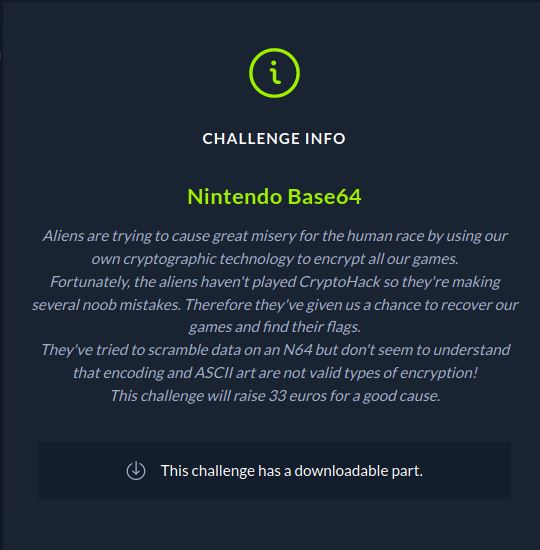
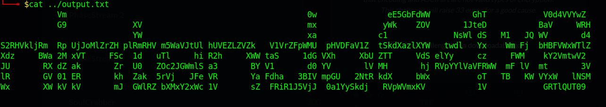

# CTF HackTheBox 2021 Cyber Apocalypse 2021 - Nintendo Base64

Category: Crypto, Points: 300



And attached file [output.txt](output.txt)

# Nintendo Base64 Solution

C'est un challenge facile pour débuté la section crypto.

Si on regarde [output.txt](output.txt):



On peut voir nintendo64x8 

Si on décode 8 fois le code qui est en Base 64 alors on obtient alors le flag ```CHTB{3nc0d1ng_n0t_3qu4l_t0_3ncrypt10n}```.
