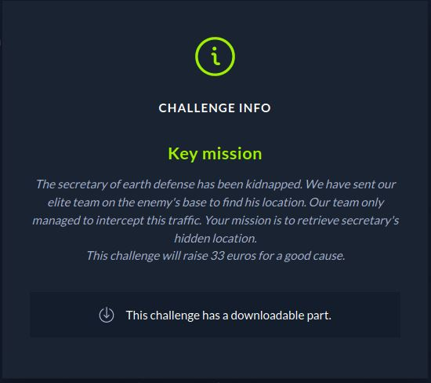
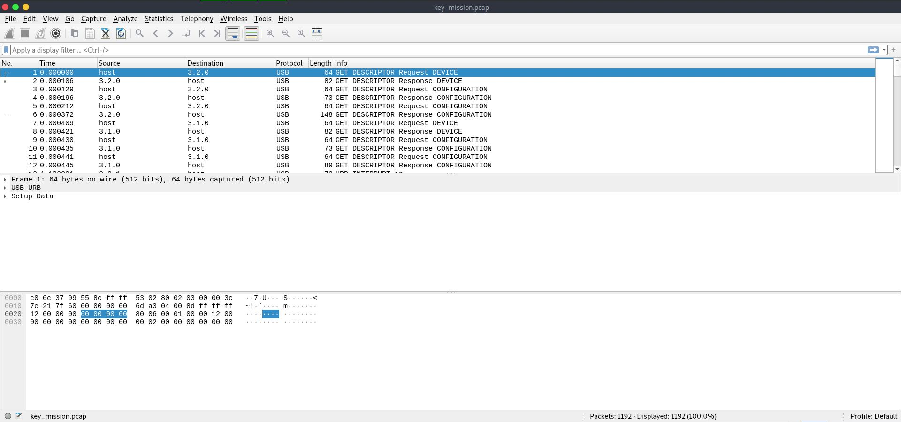

# CTF HackTheBox 2021 Cyber Apocalypse 2021 - Key Mission

Forensics: Forensics, Points: 325




Fichier Donnée [forensics_key_mission.zip](forensics_key_mission.zip)

# Key Mission Solution

Le Fichier Donner est un .pcap, On peut l'analyser avec Wireshark:



On peut voir que l'on n'a a faire que a des packets USB.

Etant donné que ce sont des paquets envoyé par un "HID Device" on peut en déduire que cela doit être un clavier.

J'ai extrait les toute les donnée utile en utilisant cette fois ```tshark``` 

``` console
┌─[natyk@ubuntu]─[/htb/cyber_apocalypse/for/key_mission]
└──╼ $ sudo tshark -r key_mission.pcap -Y '((usb.transfer_type == 0x01) && (frame.len == 72)) && !(usb.capdata == 00:00:00:00:00:00:00:00)' -T fields -e usb.capdata  | sed 's/://g'
```

Maintenant on change l'hexadecimal en Ascii pour avoir le flag en utilisant [usb_hid_data_decode.py](usb_hid_data_decode.py)
```
┌─[evyatar@parrot]─[/ctf_htb/cyber_apocalypse/forensics/key_mission]
└──╼ $ python3 usb_hid_data_decode.py payload.bin 
Ispaceamspacesendingspacesecretary'sspacelocationspaceoverspacethisspacetotallyspaceencryptedspacechannelspacetospacemakespacesurespacenospaceonespaceelsespacewill
spacebespaceablespacetospacereadspaceitspaceexceptspaceofspaceus.spaceThisspaceinformationspaceisspaceconfidentialspaceandspacemustspacenotspacebespacesharedspace
withspaceanyonespaceelse.spaceThespacesecretary'sspacehiddenspacelocationspaceisspaceCHTB{a_plac3_fAr_fAr_away_fr0m_earth}
```

Et nous avons le Flag ! ```CHTB{a_plac3_fAr_fAr_away_fr0m_earth}```.
