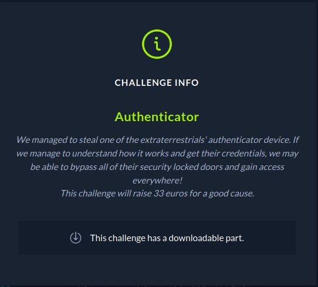

# CTF HackTheBox 2021 Cyber Apocalypse 2021 - Authenticator

Category: Reversing, Points: 300



Fichier Donné: [authenticator](authenticator)

# Authenticator Solution

Si on lance le Fichier:
```console
┌─[natyk@kali]─[/htb/cyber_apocalypse/rev/authenticator]
└──╼ $ ./authenticator 

Authentication System 👽

Please enter your credentials to continue.

Alien ID: A
Access Denied!
```

On peut voir que le Program check l'entrée de l'utilisateur et si l'entrée est mauvaise nous renvoie "Access Denied!"

Si on essaie de le lancer avec ltrace:
```c
┌─[natyk@kali]─[/htb/cyber_apocalypse/rev/authenticator]
└──╼ $ ltrace ./authenticator 
...
strlen("Alien ID: ")                                                                                   = 10                                                            
fgets(A                                                                                                                                                                
"A\n", 32, 0x7f1498482980)                                                                       = 0x7ffecae00e50                                                      
strcmp("A\n", "11337\n")                                                                               = 16                                                            
printf("\033[31m")                                                                                     = 5                                                             
strlen("Access Denied!\n") 
...  

```

Donc on peut voir qu'il y a un```strcmp``` avec notre entrée:
```c
iVar1 = strcmp(local_58,"11337\n");
```

Donc si notre "Alien ID" est égal a  ```11337``` on peut passer la première verification.


Après on peut voir que le program demande un ```Pin``` quand on lance ghidra on peut voir qu'il verifie avec le pin avec la fonction ```checkpin``` , et si on rentre le mauvais pin le program renvoie "Access Denied!":
```c
printstr("Pin: ",0);
    fgets(input,0x20,stdin);
    uVar2 = checkpin(input);
    if ((int)uVar2 == 0) {
      printstr("Access Granted! Submit pin in the flag format: CHTB{fl4g_h3r3}\n",0);
    }
    else {
      printstr("Access Denied!\n",1);
    }
``` 

Observe on ```checkpin``` function:
```c

undefined8 checkpin(char *param_1)

{
  size_t sVar1;
  int local_24;
  
  local_24 = 0;
  while( true ) {
    sVar1 = strlen(param_1);
    if (sVar1 - 1 <= (ulong)(long)local_24) {
      return 0;
    }
    if ((byte)("}a:Vh|}a:g}8j=}89gV<p<}:dV8<Vg9}V<9V<:j|{:"[local_24] ^ 9U) != param_1[local_24])
    break;
    local_24 = local_24 + 1;
  }
  return 1;
}
```

On peut voir qu'il y a un ```if```:
```c
if ((byte)("}a:Vh|}a:g}8j=}89gV<p<}:dV8<Vg9}V<9V<:j|{:"[local_24] ^ 9U) != param_1[local_24])
```

Ce If fais un XOR 9 avec chaque charactère ```"}a:Vh|}a:g}8j=}89gV<p<}:dV8<Vg9}V<9V<:j|{:"``` et vérifier si c'est egal a notre entrée, Donc si on XOR cette chaine de charactère alors on notre flag.

J'ai du coup lancé [Cyberchef](https://gchq.github.io/CyberChef/#recipe=XOR(%7B'option':'Hex','string':'9'%7D,'Standard',false)&input=fWE6Vmh8fWE6Z304aj19ODlnVjxwPH06ZFY4PFZnOX1WPDlWPDpqfHs6)

j'ai ensuite essayé le mot de passe sur le program:
```console
┌─[natyk@kali]─[/htb/cyber_apocalypse/rev/authenticator]
└──╼ $ ./authenticator

Authentication System 👽

Please enter your credentials to continue.

Alien ID: 11337
Pin: th3_auth3nt1c4t10n_5y5t3m_15_n0t_50_53cur3
Access Granted! Submit pin in the flag format: CHTB{fl4g_h3r3}
                                                                 
```

Et voila ! : ```CHTB{th3_auth3nt1c4t10n_5y5t3m_15_n0t_50_53cur3}```.
