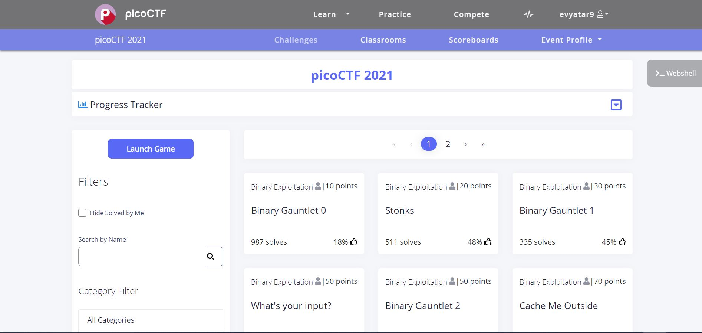

# picoCTF 2021 - CMU Cybersecurity Competition

Writeups pour [picoCTF 2021](https://picoctf.org/competitions/2021-spring.html)

Images:

## Articles
1. [Du Security Magazine](https://www.securitymagazine.com/articles/94810-carnegie-mellon-university-to-launch-picoctf-cybersecurity-event-next-week)
2. [Du Carnegie Mellon University](https://www.cmu.edu/news/stories/archives/2021/march/picoctf-contest.html)
3. [Du Elearning Inside](https://news.elearninginside.com/picoctf-the-largest-k-12-online-hacking-competition-kicks-off-today/)
