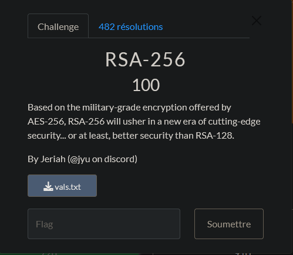

# CTF UTCTF 2024 - RSA-256

Cryptography : 100 Points 



Fichier Donnée [vals.txt](vals.txt)

# RSA-256 Solution

On nous donne un fichier ```vals.txt``` qui contient 3 valeurs : ```n=77483692467084448965814418730866278616923517800664484047176015901835675610073``` ,  ```e=65537``` et ```c=43711206624343807006656378470987868686365943634542525258065694164173101323321``` .

On nous demande de trouver le message original ```m``` .

Pour cela, on va utiliser la formule de déchiffrement RSA qui est la suivante:

```m = c^d mod n```

On va donc commencer par calculer la clé privée ```d``` en utilisant la formule suivante:

```d = e^-1 mod phi(n)```

Où ```phi(n) = (p-1)*(q-1)``` et ```n = p*q``` .

On a donc 2 choix pour trouver les valeurs de ```p``` et ```q``` :

- Soit on factorise ```n``` en utilisant un outil en ligne comme [factordb](http://factordb.com/) .

- Soit on utilise la méthode de [Wiener](https://en.wikipedia.org/wiki/Wiener%27s_attack) pour trouver la clé privée ```d``` .

Dans notre cas, on va utiliser la méthode de Wiener.

```python

from Crypto.Util.number import inverse

def wiener(e, n):
    # Algorithme de Wiener
    # https://en.wikipedia.org/wiki/Wiener%27s_attack
    #

    # On initialise les variables
    d = 0
    k = 1
    while True:
        # On calcule la fraction continue
        a = e * k + 1
        b = n
        q = a // b

        # On met à jour les variables
        k, d = q, k
        a, b = b, a % b

        # On vérifie si on a trouvé la clé privée
        if b == 0:
            return d

# On initialise les valeurs
n = 77483692467084448965814418730866278616923517800664484047176015901835675610073
e = 65537

# On trouve la clé privée d
d = wiener(e, n)
print(d)

```

On trouve la clé privée ```d``` .

On peut maintenant déchiffrer le message ```c``` en utilisant la formule suivante:

```m = c^d mod n```

```python

# On initialise les valeurs
n = 77483692467084448965814418730866278616923517800664484047176015901835675610073
e = 65537
c = 43711206624343807006656378470987868686365943634542525258065694164173101323321

# On déchiffre le message
m = pow(c, d, n)
print(m)

```
On trouve le message original qui est le flag ```m = utflag{just_send_plaintext}``` .


