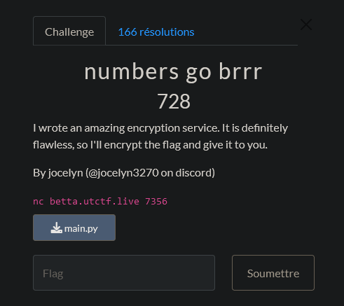

# CTF UTCTF 2024 - numbers go brrr

Cryptography : 728 Points



Fichier Donnée [main.py](main.py)

# numbers go brrr Solution

On nous donne un fichier `main.py` qui contient un code Python :

```python
#!/usr/bin/env python3
from Crypto.Cipher import AES
from Crypto.Util.Padding import pad
from Crypto.Random import random

seed = random.randint(0, 10 ** 6) 
def get_random_number():
    global seed 
    seed = int(str(seed * seed).zfill(12)[3:9])
    return seed


def encrypt(message):
    key = b''
    for i in range(8):
        key += (get_random_number() % (2 ** 16)).to_bytes(2, 'big')
    cipher = AES.new(key, AES.MODE_ECB)
    ciphertext = cipher.encrypt(pad(message, AES.block_size))
    return ciphertext.hex()

print("Thanks for using our encryption service! To get the encrypted flag, type 1. To encrypt a message, type 2.")
while True:
    print("What would you like to do (1 - get encrypted flag, 2 - encrypt a message)?")
    user_input = 2
    if(user_input == 1):
        break
    print("What is your message?")
    message = input()
    print(encrypt(message.encode()))


flag = open('/src/flag.txt', 'r').read()
print("Here is the encrypted flag:", encrypt(flag.encode()))

```

Le code génère une clé de chiffrement AES en utilisant la fonction encrypt. La clé est générée en utilisant une seed aléatoire qui est générée en utilisant la fonction get_random_number.

La seed est un nombre aléatoire entre 0 et 10^6. elle est ensuite multipliée par elle-même et les 3ème à 9ème chiffres sont utilisés comme nouvelle seed.

La clé est générée en utilisant 8 8 seed aléatoire de 2 octets chacun.

pour au final avec un message qui est chiffré en utilisant la clé générée et le mode de chiffrement AES ECB.

Donc notre objectif est de retrouver la clé de chiffrement utilisée pour chiffrer le flag.

Pour cela on va utiliser une attaque par force brute pour retrouver la clé de chiffrement , cela est possible car la seed est générée aléatoirement entre 0 et 10^6 donc on peut tester toutes les valeurs possibles de la seed pour retrouver la clé de chiffrement. 

```python

from Crypto.Cipher import AES
from Crypto.Util.Padding import unpad
def is_valid_plaintext(plaintext):
    """
    Fonction pour vérifier si le texte brut est valide (ASCII imprimable).

    Args:
        plaintext (bytes): Le texte brut à tester.

    Returns:
        bool: True si le texte est valide, False sinon.
    """
    try:
        plaintext.decode('ascii')
        return True
    except UnicodeDecodeError:
        return False
    
    
def brute_force_attack(ciphertext):
    """
    Fonction d'attaque par force brute pour retrouver la clé utilisée.

    Args:
        ciphertext (bytes): Le texte chiffré.
        plaintext (bytes): Le texte clair correspondant au texte chiffré.

    Returns:
        bytes: La clé trouvée, ou None si aucune clé correspondante n'est trouvée.
    """
    block_size = AES.block_size
    for seed in range(10**6):
        key = generate_key_from_seed(seed)
        cipher = AES.new(key, AES.MODE_ECB)
        decrypted_text = cipher.decrypt(ciphertext)
        try:
            decrypted_text = unpad(decrypted_text, block_size)
            print(decrypted_text)
            if is_valid_plaintext(decrypted_text):
                return key
        except ValueError:
            # La désérialisation a échoué, essayez la prochaine clé
            continue
    return None

def generate_key_from_seed(seed):
    """
    Fonction pour générer une clé à partir d'une valeur de départ ("seed").

    Args:
        seed (int): La valeur de départ.

    Returns:
        bytes: La clé générée.
    """
    key = b''
    for _ in range(8):
        seed = int(str(seed * seed).zfill(12)[3:9])
        key_part = (seed % (2 ** 16)).to_bytes(2, 'big')
        key += key_part
    # Si la longueur de la clé est inférieure à 16 octets on rajoute des zéros
    while len(key) < 16:
        key += b'\x00'
    return key[:16]  


ciphertext = bytes.fromhex("flag_chiffré") # Chiffrement du flag

key = brute_force_attack(ciphertext)
if key is not None:
    print("Clé trouvée:", key.hex())
    cipher = AES.new(key, AES.MODE_ECB)
    plaintext = cipher.decrypt(ciphertext)
    print("Texte clair déchiffré:", plaintext)
else:
    print("Aucune clé correspondante trouvée.")

```

On obtient la clé de chiffrement et le texte clair déchiffré `b'utflag{r4nd0m_numb3rs_ar3nt_th4t_r4nd0m}'`.


