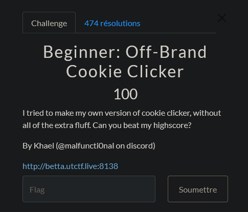
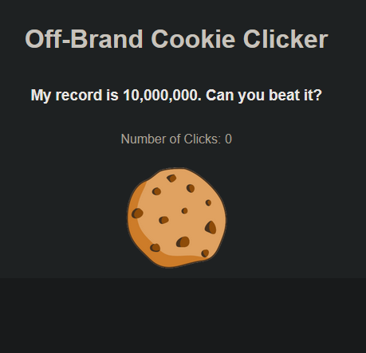
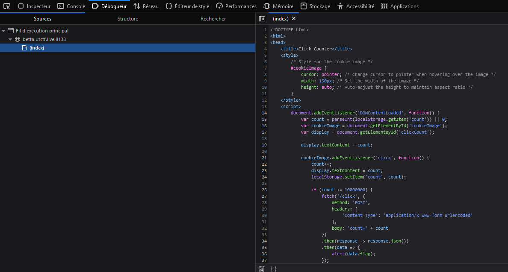
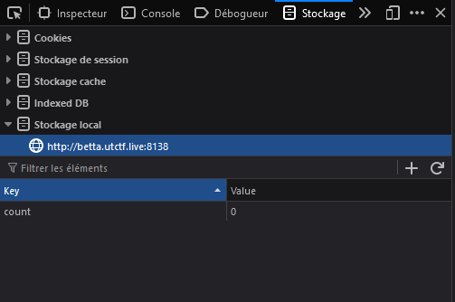
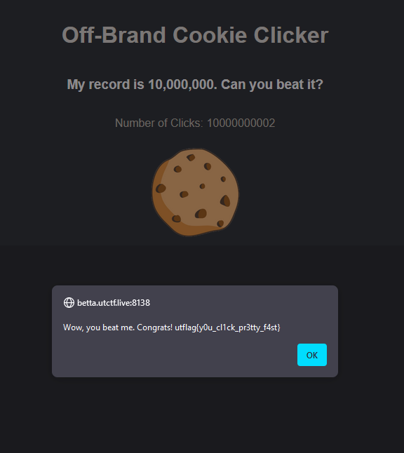

# CTF UTCTF 2024 - Beginner : Off Brand Cookie Clicker

Web : 100 Points

# 

# Beginner : Off Brand Cookie Clicker Solution

On nous donne un lien vers un site web qui est un cookie clicker , le but est de cliquer sur le cookie pour obtenir le flag au bout de 10,000,000 de clics.

Vu que le nombre de clics est très grand, on va essayer de trouver une autre solution pour obtenir le flag. 

On va donc ouvrir les outils de développement de notre navigateur pour voir le code source de la page.

On peut voir le javascript utilisé pour le cookie clicker , le nombre de clics est stocké dans une variable `count` qui est incrémentée à chaque clic et elle est stockée dans le `localStorage` du navigateur.

En allant dans l'onglet `Stockage` de notre outil de développement puis stockage local on peut trouver une clé `count` qui contient le nombre de clics actuel.

Si on change le nombre de clics à plus de 10,000,000 et qu'on rafraichit la page, on obtient le flag.

