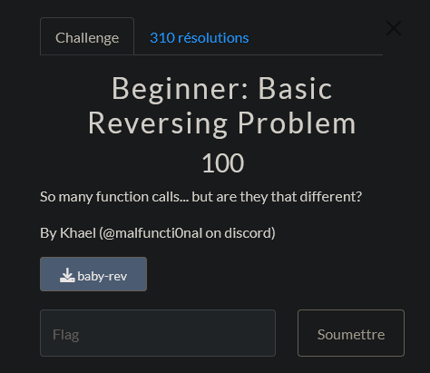
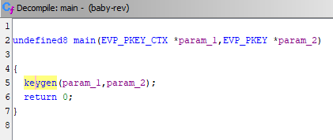
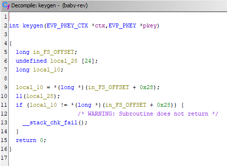
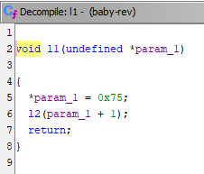

# CTF UTCTF 2024 - Beginner : Basic Reversing Problem 

Reverse Engineering : 100 Points

Fichier Donnée [baby_rev](baby_rev)

# Beginner : Basic Reversing Problem Solution

On nous donne un fichier `baby_rev` qui contient un binaire.

On nous demande de trouver le flag.

Pour cela, on va commencer par ouvrir le fichier avec un logiciel comme Ghidra qui va nous permettre de voir le code source du binaire.

On va donc ouvrir le fichier `baby_rev` avec Ghidra et selectionner la fonction `main` pour voir le code.

On peut voir que le code est assez simple, une seul fonction est appelée `keygen` qui prend en paramètre 2 arguments : `param_1` et `param_2` .

Quand on regarde la fonction `keygen` , il y a 2 variable intéressantes : `local_28` et `local_10` .

On peut déduire que le flag est stocké dans le tableau `local_28` et que local_10 est la longueur du flag.

On va donc suivre la fonction `keygen` pour voir comment le flag est généré.

Il y a 1 fonction qui est appelée et qui prend en paramètre `local_28` et c'est la fonction `l1` .

On voit que la fonction `l1` prend en paramètre le tableau `local_28` et change la première valeur du tableau en `0x75` qui est la lettre `u` en ASCII.Pour ensuite appeler la fonction `l2` avec la cellule suivante du tableau pour faire le même traitement avec 2ème valeur du tableau et ainsi de suite.

Donc si on suit l'appel des fonction alors ce retrouve avec le flag suivant : `utflag{i_c4n_r3v!}`

